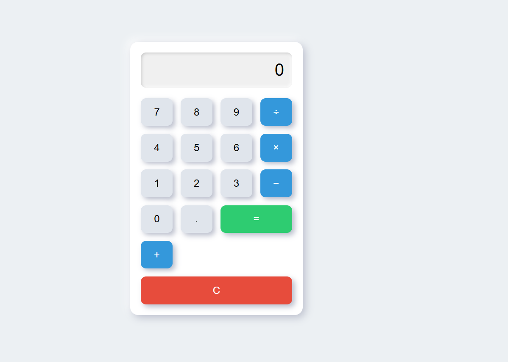

# 🔢 Calculator App

A simple, responsive calculator built with **HTML, CSS, and JavaScript**.  
It performs basic arithmetic operations — addition, subtraction, multiplication, and division — with a clean, modern UI.

---

## 🚀 Features
✅ Perform basic calculations: `+`, `-`, `×`, `÷`  
✅ Supports decimal numbers  
✅ Clear (`C`) button to reset  
✅ Responsive design for desktop & mobile  
✅ Built with vanilla JavaScript — no external libraries

---

## 📸 Screenshots
<p align="center">
  
</p>

---

## 💻 Tech Stack
- **HTML5** — structure of the calculator interface  
- **CSS3** — styling and responsive layout  
- **JavaScript** — handling user input, building expressions, evaluating results

---

## 🚀 How to Run Locally
1. **Clone this repository**
    ```bash
    git clone https://github.com/your-username/calculator-app.git
    cd calculator-app
    ```

2. **Open `index.html` in your browser**
    - That’s it — no build tools needed!

---

## ✏️ How to Use
- Click the number and operator buttons to build an expression.
- Press `=` to evaluate and display the result.
- Use `C` to clear the current calculation.

---

## 🚀 Future Enhancements
- Add keyboard input support (type numbers & operators on your keyboard).
- Include parentheses for more complex calculations.
- Implement advanced functions (square roots, powers, etc.).
- Dark mode toggle.

---

## 🤝 Contributing
Contributions, issues, and feature requests are welcome!  
Feel free to fork the repo and submit a pull request.


---

## ⭐ Acknowledgments
Inspired by classic calculator apps and built as a project to strengthen JavaScript and UI development skills.

---

<p align="center">
  ⭐️ If you like this project, please give it a star on GitHub!
</p>
